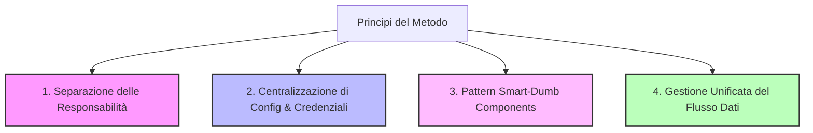

# 🚀 Blueprint Architetturale: Metodo di Lavoro "Clean & Simple" per Progetti Frontend

Questo documento descrive il **metodo di lavoro, l'architettura e i design pattern** emersi dall'analisi del progetto **AlloCiné**. Questo approccio si distingue per la straordinaria **pulizia, semplicità e separazione delle responsabilità (Separation of Concerns)**. 

È pensato come una guida pratica ed un **blueprint riutilizzabile** per qualsiasi futuro progetto frontend (React + Vite + Bootstrap o simili) che effettua chiamate ad API REST esterne.

---

## 📌 1. I Principi Cardine del Metodo

La pulizia del codice in questo progetto si basa su 4 pilastri fondamentali:



1. **Separazione delle Responsabilità (Separation of Concerns)**:
   - I componenti della UI non sanno *come* i dati vengono recuperati (non vedono URL, endpoint, né token di autenticazione).
   - I servizi API non sanno *come* i dati verranno visualizzati.
2. **Centralizzazione delle Configurazioni**:
   - Credenziali, token, URL di base ed intestazioni HTTP (Headers) sono confinati in un unico file di configurazione (`config.js`).
3. **Pattern "Smart Components" (Pagine) vs "Dumb Components" (Presentazionali)**:
   - **Pagine (Smart)**: Gestiscono lo stato, effettuano chiamate asincrone ai servizi, estraggono i parametri dall'URL e orchestrano la vista.
   - **Componenti (Dumb)**: Ricevono i dati esclusivamente tramite `props`, li visualizzano e usano callback o navigazione per delegare le azioni.
4. **Flusso Dati Unificato e Prevedibile**:
   - `useEffect` controlla le transizioni di stato e i caricamenti asincroni, reagendo al cambiamento di parametri chiave (es. il cambio della pagina corrente per ricaricare la lista corretta).

---

## 📂 2. La Struttura delle Cartelle Ideale

Per replicare questo metodo di lavoro, la directory `src` deve essere organizzata come segue:

```
src/
│
├── Services/               # ── L'unico strato che comunica con l'esterno
│   ├── config.js           # Credenziali, Token, costanti di configurazione e Header comuni
│   ├── ResourceAService.js # Servizio per la risorsa A (es. MoviesService)
│   └── ResourceBService.js # Servizio per la risorsa B (es. PeoplesService)
│
├── Components/             # ── Componenti UI Generici e Riutilizzabili (Dumb)
│   ├── NavBar.jsx          # Barra di navigazione globale
│   ├── CustomCard.jsx      # Card singola riutilizzabile (es. MovieCard)
│   ├── Carousel.jsx        # Carosello o contenitore a scorrimento orizzontale
│   └── Paginations.jsx     # Componente di paginazione standardizzato
│
├── Pages/                  # ── Pagine della web app (Smart Components)
│   ├── HomePage.jsx        # Dashboard / Home con chiamate multiple
│   ├── ResourcePage.jsx    # Pagina lista con paginazione
│   └── DetailPage.jsx      # Pagina dettaglio con parametri dinamici (:id)
│
├── App.jsx                 # Routing centrale (React Router) e gestione del tema globale
├── App.css                 # Stili CSS custom mirati ed essenziali
├── index.css               # Reset grafici globali
└── main.jsx                # Punto di ingresso dell'applicazione
```

---

## 🛠️ 3. Strato Servizi: Centralizzazione e Integrazione API

Il modo in cui vengono effettuate le chiamate API è uno dei punti di forza di questo approccio. Invece di disseminare chiamate `fetch` o `axios` nei componenti, viene creato un **Service Layer** dedicato.

### Passaggio A: Il file `Services/config.js`
In questo file si centralizzano i dati sensibili o configurazioni ricorrenti. In questo modo, se cambia il token o l'URL dell'API, si modifica **solo un file**.

```javascript
// src/Services/config.js
export const TOKEN = "IL_TUO_BEARER_TOKEN_QUI";
export const ACCOUNT_ID = "IL_TUO_ACCOUNT_ID_OPZIONALE";

// Centralizzazione degli header di autorizzazione per Axios
export const HEADER = {
    headers: {
        "Authorization": "Bearer " + TOKEN
    }
};
```

### Passaggio B: Il Servizio Specifico (es. `Services/MoviesService.js`)
Ogni servizio espone una serie di funzioni dedicate ad una singola entità. **Tutte le funzioni restituiscono la Promise generata da Axios**, consentendo alle pagine di gestire il caricamento e i dati in modo nativo con `async/await` o `.then()`.

> [!TIP]
> Notare l'uso dei parametri delle funzioni che vengono mappati direttamente come query string dell'URL dell'API esterna, mantenendo le firme delle funzioni pulite ed intuitive.

```javascript
// src/Services/MoviesService.js
import axios from "axios";
import { ACCOUNT_ID, HEADER } from "./config";

const BASE_URL = "https://api.themoviedb.org/3";

// 1. Chiamata GET semplice
function getMoviesPlaying() {
    return axios.get(`${BASE_URL}/movie/now_playing?language=it-IT`, HEADER);
}

// 2. Chiamata GET con parametri dinamici (paginazione)
function getMovies(page) {
    return axios.get(`${BASE_URL}/discover/movie?language=it-IT&page=${page}`, HEADER);
}

// 3. Chiamata GET con ID dinamico (dettaglio)
function getMovie(id) {
    return axios.get(`${BASE_URL}/movie/${id}?language=it-IT`, HEADER);
}

// 4. Chiamata POST per inviare dati
function addToFavorite(payload) {
    return axios.post(`${BASE_URL}/account/${ACCOUNT_ID}/favorite`, payload, HEADER);
}

// Esportazione di un oggetto contenente tutti i metodi del servizio
export default {
    getMoviesPlaying,
    getMovies,
    getMovie,
    addToFavorite
};
```

---

## 🎨 4. I Componenti Presentazionali (Dumb Components)

I componenti in `src/Components` devono solo preoccuparsi dell'interfaccia utente. Ricevono dati ed eventi sotto forma di `props` e sono **completamente disaccoppiati dall'API**.

### Esempio: `src/Components/MovieCard.jsx`
Una card che mostra i dati di un film. Non effettua chiamate di rete. Se l'utente clicca sul pulsante, si attiva la navigazione tramite l'hook `useNavigate()` fornito da `react-router-dom`.

```jsx
import { Button, Card } from "react-bootstrap";
import { useNavigate } from "react-router-dom";
import { FaFilm } from "react-icons/fa";

const MovieCard = ({ movie }) => {
    const navigate = useNavigate();

    return (
        <Card 
            className="film-border-card position-relative bg-dark text-white" 
            style={{ width: '16rem' }} 
            onClick={() => navigate("/movie/" + movie.id)}
        >
            <span className="cinema-icon"><FaFilm /></span>
            <Card.Img variant="top" src={"https://image.tmdb.org/t/p/original" + movie.poster_path} />
            <Card.Body className="d-flex flex-column justify-content-between">
                <Card.Title className="text-truncate">{movie.title}</Card.Title>
                <Card.Text className="text-light text-overflow-custom">
                    {movie.overview}
                </Card.Text>
                <Button 
                    variant="primary" 
                    onClick={(e) => {
                        e.stopPropagation(); // Evita il trigger del click sulla Card intera
                        navigate("/movie/" + movie.id);
                    }}
                >
                    Vedi Dettagli
                </Button>
            </Card.Body>
        </Card>
    );
};

export default MovieCard;
```

---

## 🧠 5. Le Pagine (Smart Components / Orchestrator)

Le pagine coordinano tutto il flusso logico dell'applicazione. Sono le uniche ad importare i file dei **Services** ed a gestire lo stato asincrono dell'applicazione.

### Caso Studio A: Pagina Lista con Paginazione (`src/Pages/MoviesPage.jsx`)
Questa pagina mostra come gestire in modo estremamente pulito la paginazione e il recupero dei dati.

```jsx
import { useEffect, useState } from "react";
import { Container } from "react-bootstrap";
import MoviesService from "../Services/MoviesService";
import MovieCard from "../Components/MovieCard";
import Paginations from "../Components/Paginations";

const MoviesPage = () => {
    const [movies, setMovies] = useState([]);
    const [maxPages, setMaxPages] = useState(500); // Limite API o dinamico
    const [currentPage, setCurrentPage] = useState(1);

    // Funzione asincrona dedicata al recupero dati
    const fetchMovies = async () => {
        try {
            const response = await MoviesService.getMovies(currentPage);
            setMovies(response.data.results);
        } catch (error) {
            console.error("Errore nel recupero dei film:", error);
        }
    };

    // Effetto che risponde al cambiamento della pagina corrente
    useEffect(() => {
        fetchMovies();
        // Sposta l'utente in cima alla pagina per una UX premium ad ogni cambio pagina
        window.scrollTo({ top: 0, behavior: "smooth" });
    }, [currentPage]); // Dipendenza cruciale!

    return (
        <Container fluid className="d-flex flex-column align-items-center pt-3 gap-3">
            <h1 className="my-3">I Nostri Film</h1>

            {/* Layout a griglia flessibile ottenuto solo con classi utility Bootstrap */}
            <div className="d-flex flex-wrap gap-3 justify-content-center">
                {movies.map((movie) => (
                    <MovieCard movie={movie} key={movie.id} />
                ))}
            </div>

            {/* Componente di paginazione riutilizzabile */}
            <Paginations 
                currentPage={currentPage} 
                maxPages={maxPages} 
                setCurrentPage={setCurrentPage} 
            />
        </Container>
    );
};

export default MoviesPage;
```

### Caso Studio B: Pagina di Dettaglio con Logica Complessa (`src/Pages/MoviePage.jsx`)
In questo caso, la pagina estrae l'ID dall'URL tramite `useParams()` e gestisce molteplici stati correlati ad un singolo film (dati di base, presenza nei preferiti, watchlist, ecc.).

```jsx
import { useEffect, useState } from "react";
import { useParams } from "react-router-dom";
import MoviesService from "../Services/MoviesService";
import { Container, Button } from "react-bootstrap";

const MoviePage = () => {
    const { id } = useParams(); // Estrazione dinamica del parametro '/movie/:id'
    const [movie, setMovie] = useState({});
    const [isInFavorite, setIsInFavorite] = useState(false);

    const fetchMovieData = async () => {
        try {
            const movieRes = await MoviesService.getMovie(id);
            setMovie(movieRes.data);
        } catch (error) {
            console.error(error);
        }
    };

    const handleToggleFavorite = async () => {
        try {
            const payload = {
                media_type: "movie",
                media_id: id,
                favorite: !isInFavorite
            };
            await MoviesService.addToFavorite(payload);
            setIsInFavorite(!isInFavorite);
        } catch (error) {
            console.error(error);
        }
    };

    useEffect(() => {
        fetchMovieData();
        // Qui si potrebbero lanciare anche controlli sullo stato (es. se è già nei preferiti)
    }, [id]); // Ricarica se l'ID cambia (es. navigando tra film simili)

    return (
        <Container className="pt-4 text-white">
            <div className="row">
                <div className="col-md-4">
                    
                </div>
                <div className="col-md-8">
                    <h1>{movie.title}</h1>
                    <Button 
                        variant={isInFavorite ? "danger" : "success"} 
                        className="my-3"
                        onClick={handleToggleFavorite}
                    >
                        {isInFavorite ? "Rimuovi dai Preferiti" : "Aggiungi ai Preferiti"}
                    </Button>
                    <h3>Descrizione</h3>
                    <p className="lead">{movie.overview || "Nessuna descrizione disponibile."}</p>
                </div>
            </div>
        </Container>
    );
};

export default MoviePage;
```

---

## 🎛️ 6. Il Pattern della Paginazione Riutilizzabile

Un elemento che spesso appesantisce il codice dei progetti React è la paginazione. Il componente `Paginations.jsx` implementa una logica molto pulita che calcola in modo dinamico i bottoni da mostrare, i salti di 5 pagine (tramite Ellipsis) e gestisce l'input per cambiare pagina esclusivamente modificando lo stato del padre (`setCurrentPage`).

```jsx
// src/Components/Paginations.jsx
import { Pagination } from "react-bootstrap";

const Paginations = ({ currentPage, maxPages, setCurrentPage }) => {
    return (
        <Pagination className="my-4">
            {currentPage > 1 && (
                <>
                    <Pagination.First onClick={() => setCurrentPage(1)} />
                    <Pagination.Prev onClick={() => setCurrentPage(currentPage - 1)} />
                    <Pagination.Item onClick={() => setCurrentPage(1)}>1</Pagination.Item>
                </>
            )}

            {currentPage - 5 > 0 && (
                <Pagination.Ellipsis onClick={() => setCurrentPage(currentPage - 5)} />
            )}

            {currentPage > 2 && (
                <Pagination.Item onClick={() => setCurrentPage(currentPage - 1)}>
                    {currentPage - 1}
                </Pagination.Item>
            )}

            <Pagination.Item active>{currentPage}</Pagination.Item>

            {currentPage + 1 < maxPages && (
                <Pagination.Item onClick={() => setCurrentPage(currentPage + 1)}>
                    {currentPage + 1}
                </Pagination.Item>
            )}

            {currentPage + 5 <= maxPages && (
                <Pagination.Ellipsis onClick={() => setCurrentPage(currentPage + 5)} />
            )}

            {currentPage < maxPages && (
                <>
                    {currentPage + 1 !== maxPages && (
                        <Pagination.Item onClick={() => setCurrentPage(maxPages)}>{maxPages}</Pagination.Item>
                    )}
                    <Pagination.Next onClick={() => setCurrentPage(currentPage + 1)} />
                    <Pagination.Last onClick={() => setCurrentPage(maxPages)} />
                </>
            )}
        </Pagination>
    );
};

export default Paginations;
```

---

## 🗺️ 7. Integrazione nel file `App.jsx` (Routing e Tema Globale)

Il file `App.jsx` si occupa di inizializzare l'applicazione, gestire il routing tramite `react-router-dom` e governare le preferenze globali come il **Tema Scuro/Chiaro**.

```jsx
// src/App.jsx
import { BrowserRouter, Route, Routes } from 'react-router-dom';
import { useEffect, useState } from 'react';
import HomePage from './Pages/HomePage';
import MoviesPage from './Pages/MoviesPage';
import MoviePage from './Pages/MoviePage';
import NavBar from './Components/NavBar';
import Footer from './Components/Footer';
import 'bootstrap/dist/css/bootstrap.min.css';
import './App.css';

function App() {
  const [theme, setTheme] = useState('dark');

  // Gestione dinamica delle classi CSS sul body dell'intero documento HTML
  useEffect(() => {
    document.body.classList.remove('theme-dark', 'theme-light');
    document.body.classList.add(theme === 'dark' ? 'theme-dark' : 'theme-light');
  }, [theme]);

  const toggleTheme = () => {
    setTheme((prev) => (prev === 'dark' ? 'light' : 'dark'));
  };

  return (
    <>
      <div className="theme-switch position-fixed top-0 end-0 m-3" style={{ zIndex: 1100 }}>
        <button onClick={toggleTheme} className="btn btn-outline-light btn-sm rounded-pill shadow">
          {theme === 'dark' ? '🌙 Dark Mode' : '🌞 Light Mode'}
        </button>
      </div>

      <BrowserRouter>
        <NavBar />
        <Routes>
          <Route path='/' element={<HomePage />} />
          <Route path='/movies' element={<MoviesPage />} />
          <Route path='/movie/:id' element={<MoviePage />} />
          {/* Aggiungere qui le altre rotte seguendo lo stesso standard */}
        </Routes>
      </BrowserRouter>
      
      <Footer />
    </>
  );
}

export default App;
```

---

## 📝 Checklist: Come avviare un nuovo progetto con questo Metodo

Segui questi passaggi per applicare il metodo del prof ad un nuovo progetto frontend che consuma API:

- [ ] **Inizializzazione**: Crea il progetto con Vite: `npm create vite@latest mio-progetto-api -- --template react`.
- [ ] **Dipendenze**: Installa le librerie fondamentali: `npm install axios react-router-dom react-bootstrap bootstrap react-icons`.
- [ ] **Directory setup**: Ricrea la struttura delle cartelle: `src/Services`, `src/Components`, `src/Pages`.
- [ ] **Configurazione di base**: Crea `src/Services/config.js` inserendo l'URL di base dell'API e configurando gli header di autorizzazione (se richiesti token).
- [ ] **Implementazione dei Servizi**: Crea un file di servizio per ogni entità principale dell'API (es. `AuthService.js`, `ProductsService.js`) esportando un oggetto con funzioni asincrone basate su Axios.
- [ ] **Routing in App.jsx**: Configura `BrowserRouter`, `Routes` e `Route` definendo i percorsi per le liste generali e i dettagli (`/:id`).
- [ ] **Creazione dei Componenti UI Presentazionali**: Crea le Card e la Paginazione all'interno di `src/Components`, curando che ricevano i dati esclusivamente tramite `props`.
- [ ] **Orchestra le Pagine**: Scrivi le pagine in `src/Pages` importando i Servizi. Utilizza `useState` per i dati locali e `useEffect` per effettuare il fetch all'avvio o al variare dei parametri dell'URL.

---

> [!NOTE]
> **Perché questo metodo piace ai professori (e funziona sul campo)**:
> 
> * **Scalabilità**: Se l'API esterna cambia dominio, o richiede intestazioni aggiuntive (es. una chiave di sottoscrizione), devi modificare solo `Services/config.js` o il singolo Servizio, senza toccare nessuno dei tuoi componenti grafici.
> * **Leggibilità immediata**: Un nuovo sviluppatore che entra nel team può capire l'intero flusso del programma semplicemente guardando il file `App.jsx` per le rotte e aprendo la cartella `Services` per vedere quali API vengono interrogate.
> * **Manutenibilità**: Separare la logica delle chiamate HTTP (Services) dal rendering visuale (Components) semplifica notevolmente il debug e la scrittura di test automatizzati.
